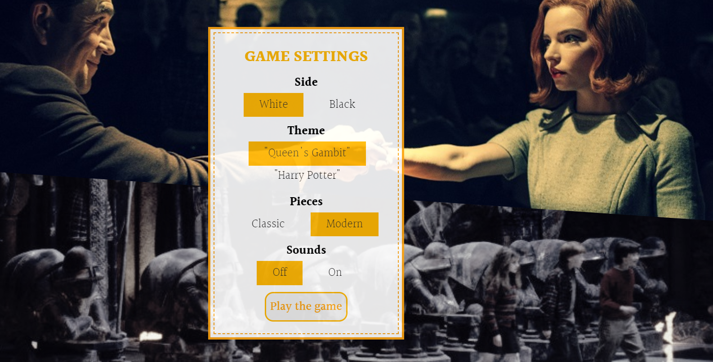

# :chess_pawn: CHESS GAME :chess_pawn:

## Overview :eye_speech_bubble:

Improve your chess skills and have fun with our game of strategy that has been 
challenging the world’s greatest thinkers for 15 centuries!

Live version: [Chess game](https://mfrydrychowiczteam.github.io/Chess-game/)

## Introduction :point_down:

Select your favorite theme and type of pieces from the settings panel and start the game.

To make a move in the game you can just click on the piece you want to move, and all the possible moves will be hightlighted.
As indicated by the rule of chess, your move can't give away your king. Our model is smart enought to detect and hide those illegal moves.
The game also includes special moves such as Castling, En Passant or Pawn promotion. 

All player movements can be viewed on the left side of the board:

After each move, the program will check the situation on the board and indicate if the game has reached an end.

Good luck and have fun!

## Team Members :muscle:

- Joanna Zioła
- Lila Religa
- Konrad Ryczko
- Marcin Pawęzka
- Małgorzata Frydrychowicz
- Patrycja Kowalczyk 

## Features

- special moves like Castling, En Passant or Pawn promotion
- logging every player action
- sounds
- themes and types of pieces
- full responsiveness
- tests

### The following technologies were used :

- HTML
- TypeScript
- SCSS
- JEST

